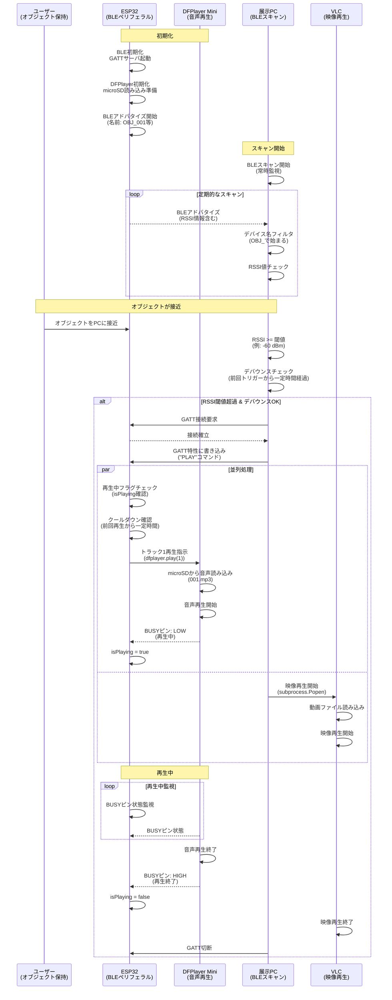
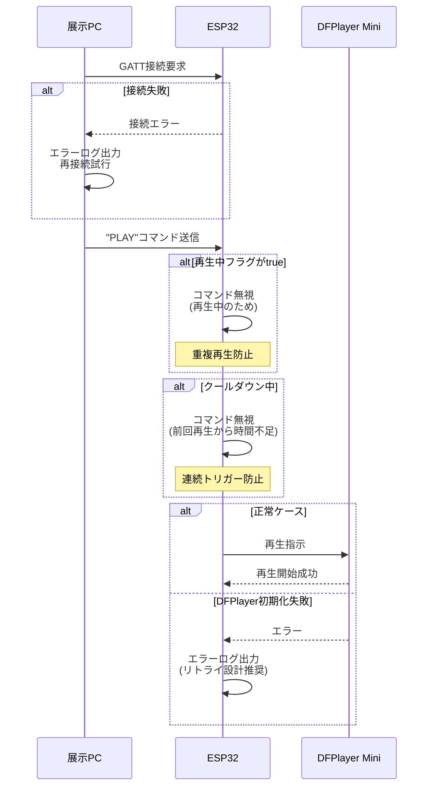
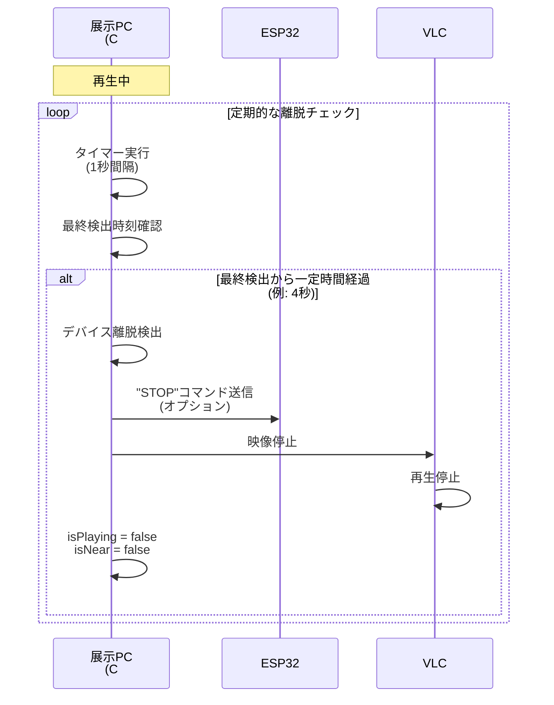
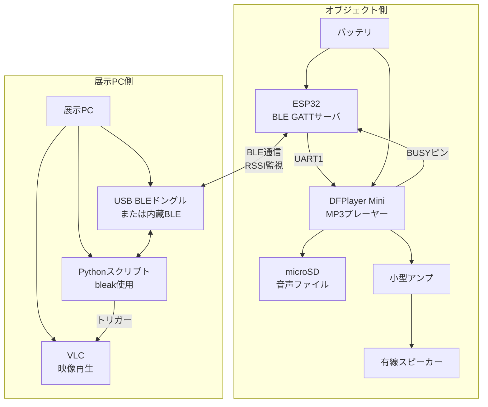

# BLE距離検知展示システム - シーケンス図

このドキュメントは、BLE距離検知で映像・音声を再生する展示システムの動作フローをシーケンス図で表現しています。

## メインシーケンス：オブジェクト接近時の再生フロー

```mermaid
sequenceDiagram
    participant User as ユーザー<br/>(オブジェクト保持)
    participant ESP32 as ESP32<br/>(BLEペリフェラル)
    participant DFPlayer as DFPlayer Mini<br/>(音声再生)
    participant PC as 展示PC<br/>(BLEスキャン)
    participant VLC as VLC<br/>(映像再生)

    Note over ESP32,DFPlayer: 初期化
    ESP32->>ESP32: BLE初期化<br/>GATTサーバ起動
    ESP32->>ESP32: DFPlayer初期化<br/>microSD読み込み準備
    ESP32->>ESP32: BLEアドバタイズ開始<br/>(名前: OBJ_001等)

    Note over PC: スキャン開始
    PC->>PC: BLEスキャン開始<br/>(常時監視)

    loop 定期的なスキャン
        ESP32-->>PC: BLEアドバタイズ<br/>(RSSI情報含む)
        PC->>PC: デバイス名フィルタ<br/>(OBJ_で始まる)
        PC->>PC: RSSI値チェック
    end

    Note over User,PC: オブジェクトが接近
    User->>ESP32: オブジェクトをPCに接近

    PC->>PC: RSSI >= 閾値<br/>(例: -60 dBm)
    PC->>PC: デバウンスチェック<br/>(前回トリガーから一定時間経過)
    
    alt RSSI閾値超過 & デバウンスOK
        PC->>ESP32: GATT接続要求
        ESP32-->>PC: 接続確立
        
        PC->>ESP32: GATT特性に書き込み<br/>("PLAY"コマンド)
        
        par 並列処理
            ESP32->>ESP32: 再生中フラグチェック<br/>(isPlaying確認)
            ESP32->>ESP32: クールダウン確認<br/>(前回再生から一定時間)
            ESP32->>DFPlayer: トラック1再生指示<br/>(dfplayer.play(1))
            DFPlayer->>DFPlayer: microSDから音声読み込み<br/>(001.mp3)
            DFPlayer->>DFPlayer: 音声再生開始
            DFPlayer-->>ESP32: BUSYピン: LOW<br/>(再生中)
            ESP32->>ESP32: isPlaying = true
        and
            PC->>VLC: 映像再生開始<br/>(subprocess.Popen)
            VLC->>VLC: 動画ファイル読み込み
            VLC->>VLC: 映像再生開始
        end
        
        Note over ESP32,DFPlayer: 再生中
        loop 再生中監視
            ESP32->>ESP32: BUSYピン状態監視
            DFPlayer-->>ESP32: BUSYピン状態
        end
        
        DFPlayer->>DFPlayer: 音声再生終了
        DFPlayer-->>ESP32: BUSYピン: HIGH<br/>(再生終了)
        ESP32->>ESP32: isPlaying = false
        
        VLC->>VLC: 映像再生終了
        
        PC->>ESP32: GATT切断
    end
```

## エラー処理とガード条件

```mermaid
sequenceDiagram
    participant PC as 展示PC
    participant ESP32 as ESP32
    participant DFPlayer as DFPlayer Mini

    PC->>ESP32: GATT接続要求
    
    alt 接続失敗
        ESP32-->>PC: 接続エラー
        PC->>PC: エラーログ出力<br/>再接続試行
    end
    
    PC->>ESP32: "PLAY"コマンド送信
    
    alt 再生中フラグがtrue
        ESP32->>ESP32: コマンド無視<br/>(再生中のため)
        Note over ESP32: 重複再生防止
    end
    
    alt クールダウン中
        ESP32->>ESP32: コマンド無視<br/>(前回再生から時間不足)
        Note over ESP32: 連続トリガー防止
    end
    
    alt 正常ケース
        ESP32->>DFPlayer: 再生指示
        DFPlayer-->>ESP32: 再生開始成功
    else DFPlayer初期化失敗
        DFPlayer-->>ESP32: エラー
        ESP32->>ESP32: エラーログ出力<br/>(リトライ設計推奨)
    end
```

## 離脱検知フロー（C#版の追加機能）

```mermaid
sequenceDiagram
    participant PC as 展示PC<br/>(C#版)
    participant ESP32 as ESP32
    participant VLC as VLC

    Note over PC: 再生中
    
    loop 定期的な離脱チェック
        PC->>PC: タイマー実行<br/>(1秒間隔)
        PC->>PC: 最終検出時刻確認
        
        alt 最終検出から一定時間経過<br/>(例: 4秒)
            PC->>PC: デバイス離脱検出
            PC->>ESP32: "STOP"コマンド送信<br/>(オプション)
            PC->>VLC: 映像停止
            VLC->>VLC: 再生停止
            PC->>PC: isPlaying = false<br/>isNear = false
        end
    end
```

## システム構成図

```mermaid
graph TB
    subgraph "オブジェクト側"
        ESP32[ESP32<br/>BLE GATTサーバ]
        DFPlayer[DFPlayer Mini<br/>MP3プレーヤー]
        SDCard[microSD<br/>音声ファイル]
        Amp[小型アンプ]
        Speaker[有線スピーカー]
        Battery[バッテリ]
        
        ESP32 -->|UART1| DFPlayer
        DFPlayer --> SDCard
        DFPlayer -->|BUSYピン| ESP32
        DFPlayer --> Amp
        Amp --> Speaker
        Battery --> ESP32
        Battery --> DFPlayer
    end
    
    subgraph "展示PC側"
        PC[展示PC]
        BLEAdapter[USB BLEドングル<br/>または内蔵BLE]
        Python[Pythonスクリプト<br/>bleak使用]
        VLC[VLC<br/>映像再生]
        
        PC --> BLEAdapter
        PC --> Python
        PC --> VLC
    end
    
    ESP32 <-->|BLE通信<br/>RSSI監視| BLEAdapter
    BLEAdapter <--> Python
    Python -->|トリガー| VLC
```

