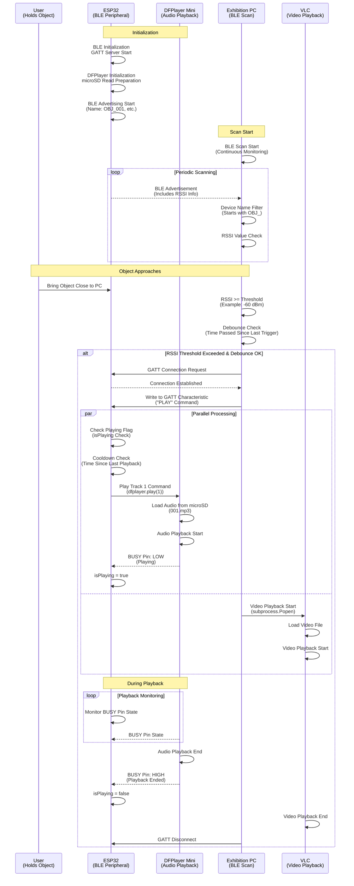
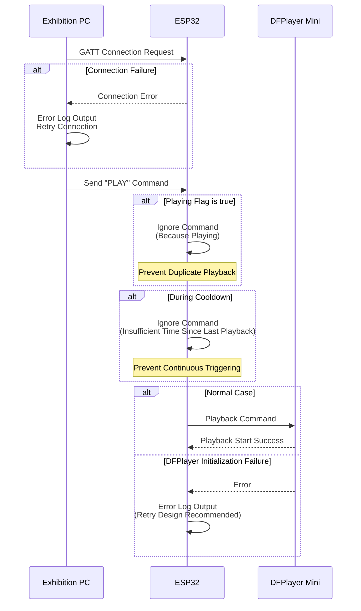
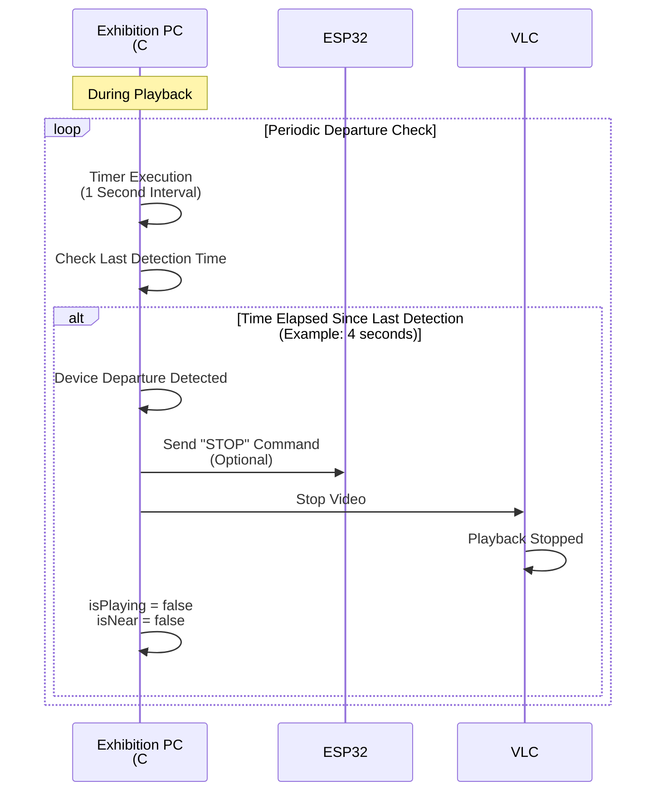
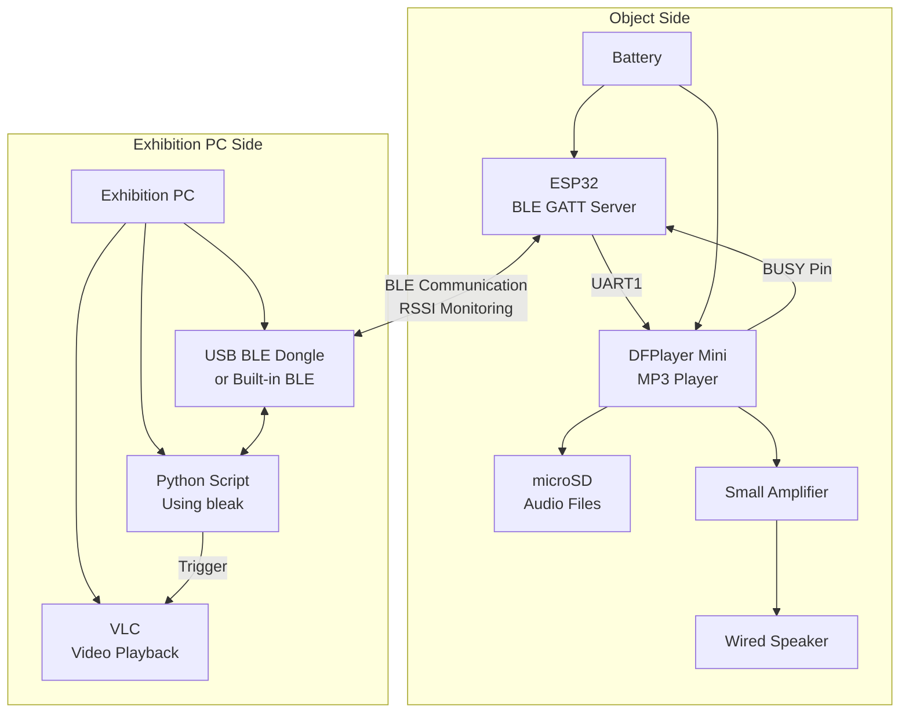

# BLE Distance Detection Exhibition System - Sequence Diagrams

This document describes the operation flow of a BLE distance detection exhibition system for video/audio playback using sequence diagrams.

## Main Sequence: Playback Flow When Object Approaches

## Error Handling and Guard Conditions

## Departure Detection Flow (C# Version Additional Feature)

## System Architecture Diagram

